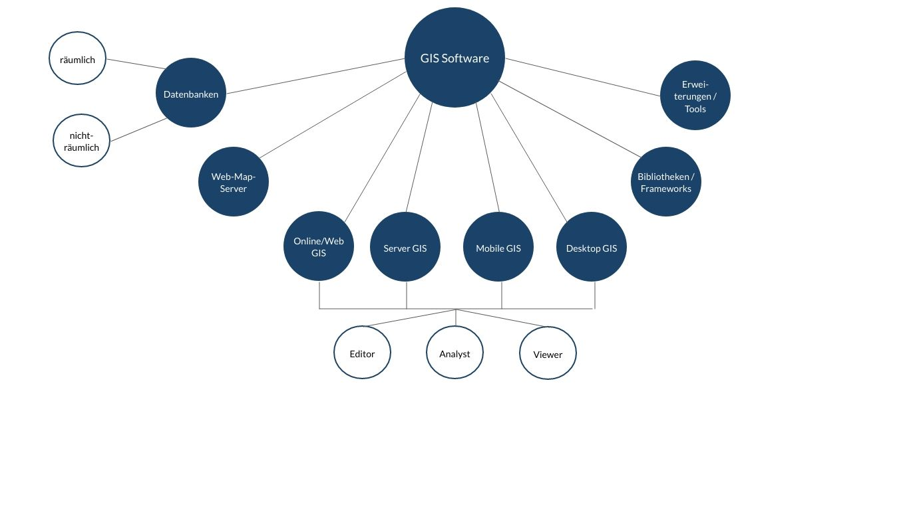

Der Begriff [GIS](/gis/was-ist-gis "Was ist GIS?")-Software kann manchmal sehr verwirrend sein.

ArcGIS, Google Maps, MySQL, FME, AutoCAD Map3D und Softwarebibliotheken fallen alle in die Kategorie GIS-Software, auch wenn mit jeder Software unterschiedliche Prozesse gehandhabt werden.

Im allgemeinen ist eine [GIS-Software](/gis/gis-software-optionen "GIS-Software Optionen") eine Software, mit der [räumliche Daten](/gis/was-sind-geodaten "Was sind Geodaten?") gespeichert, abgerufen, verwaltet, bearbeitet, analysiert oder dargestellt werden.

Dies umfasst also das eigentliche Desktop-GIS wie zum Beispiel [QGIS](https://qgis.org) oder ArcGIS, [Datenbanken](/gis/geo-datenbank-optionen/ "GIS-Datenbanken") zur Speicherung, andere Tools wie beispielsweise [FME](/gis/fme-lizenz-kostenlos/ "FME-Lizenz") mit denen Geodaten in allen Formaten bearbeitet werden können, oder auch [Web-Server](/gis/web-feature-service/ "Web Feature Service") über dene Geodaten im Internet abgerufen werden können.

Prinzipell kann man GIS-Software in folgende Unterkategorien unterteilen:

## Desktop GIS

Ein Desktop GIS wird für gewöhnlich in drei Arten angeboten.

*   GIS Viewer: Mit einem GIS Viewer können Geodaten betrachtet werden.
*   GIS Editor: Der Editor ermöglicht das Editieren bzw. die Bearbeitung von Geodaten.
*   GIS Analyst: Mit einem Analyst können die räumlichen Daten anhand verschieder Kritieren analysiert werden.

Oft werden ein Editor und Analyst auch gebündelt in einer Version angeboten

## Mobile GIS

Ein Mobile GIS ist von den Funktionen mit einem Desktop GIS zu vergleichen.

Der einzigste Unterschied ist, dass ein mobile GIS für mobile Geräte wie Smartphones und Tablets optimiert ist.

## Online/Web GIS

Ein Web GIS stellt Geodaten über einen Web Service, also über das Internet bereit. Dies hat oft nur vereinfachte Funktionen und dient primär der Darstellung von GIS-Daten für die Allgemeinheit.

## Web-Map Server

Ein Web Map Server ist die Grundlage für ein Web GIS. Der Web-Map Server stellt zum Beispiel einen einfachen Web Map Service bereit, was im Prinzip ein webbasierter Kartendienst ist.

Es gibt verschiedene Funktionsarten von Web Map Servern:

*   [Web Map Service](https://de.wikipedia.org/wiki/Web_Map_Service) (WMS)
*   [Web Map Tile Service](https://de.wikipedia.org/wiki/Web_Map_Tile_Service "Web Map Tile Service") (WMTS),
*   [Web Map Service-Caching](https://de.wikipedia.org/wiki/Web_Map_Service-Caching "Web Map Service-Caching") (WMS-C)
*   Tile Map Service (TMS)

## Datenbankverwaltungssystemes

Mit [Datenbankverwaltungssysteme](/gis/geo-datenbank-optionen "Geo-Datenbank Optionen") werden Daten anwendungsunabhängig gespeichert und verwaltet. Bei Geoinformationssystemen werden nicht-räumliche und räumliche Datenbankverwaltungssysteme verwendet.

*   räumliche Datenbankverwaltungssysteme: Dient zur Speicherung von Geometrien der Objekte
*   nicht-räumliche Datenbankverwaltungssysteme: Dient zur Speicherung von Sachdaten der Objekte

## Software Bibliotheken / Frameworks

Mit Software [Development](/web-development/ "Web-Development") Frameworks bzw. Bibliotheken können Anwendungen erstellt werden, ohne das man das Rad komplett neu erfinden muss.

Es können Geodaten auf beispielsweise verschiedene Arten gerendert, geokodiert oder auf Websiten bereitgestellt werden. Den dafür benötigten Code findet man in diesen Frameworks.
