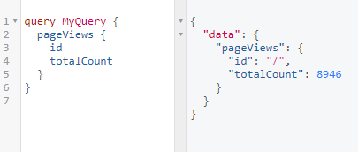

Bei fast allen Content-Management-Systemen gibt es eine relativ einfache Möglichkeit die Seitenaufrufe einer bestimmten Seite anzuzeigen, da diese im Hintergrund protokolliert werden. Bei Gatsby ist das leider nicht der Fall, weshalb man hier eine andere Lösung braucht. Man kann mit [gatsby-source-google-analytics-reporting-api](https://www.gatsbyjs.org/packages/gatsby-source-google-analytics-reporting-api/) sich die Seitenaufrufe von Google Analytics einbinden lassen. (Vorraussetzung hierfür ist natürlich, dass man Google Analytics nutzt)

## [](#gatsby-source-google-analytics-reporting-api-konfigurieren)"gatsby-source-google-analytics-reporting-api" konfigurieren

Als aller erstes benötigt man das Plugin [gatsby-source-google-analytics-reporting-api](https://www.gatsbyjs.org/packages/gatsby-source-google-analytics-reporting-api/), welches man mit

```js
    npm i gatsby-source-google-analytics-reporting-api
```

installieren kann. In `gatsby-config,js`ergänzt man dann folgendes:

```js
        {
          resolve: `gatsby-source-google-analytics-reporting-api`,
          options: {
            email: process.env.CLIENT_EMAIL,
            key: require('fs').readFileSync('private.key'),
            viewId: `115350264`,
            startDate: `2009-01-01`,
          }
        },
```

Nun kann man mit GraphQL Seitenaufrufe von bestimmten Seiten über die Analytics Reporting API abfragen.

## [](#seitenaufrufe-abfragen)Seitenaufrufe abfragen


Um die Seitenaufrufe für eine spezifische Seite bekommen zu können brauch man nun irgendeine Variable, die eine Seite eindeutig identifiziert, welche dann in die GraphQL Abfrage eingebaut wird.

In meinen Fall nutze ich die Variable "slug", die immer den relativen Link zu einer Seite gespeichert hat. Diese Variable wird dann als "Filter" genutzt.

```graphql
        pageViews(id: {eq: $slug }) {
          id
          totalCount
        }
```

Das Ergebnis der Abfrage muss man nun noch einer neuen Variable z.B. "postViews" zuweisen und dann können mit dieser die Seitenaufrufe für eine Seite dargestellt werden. 