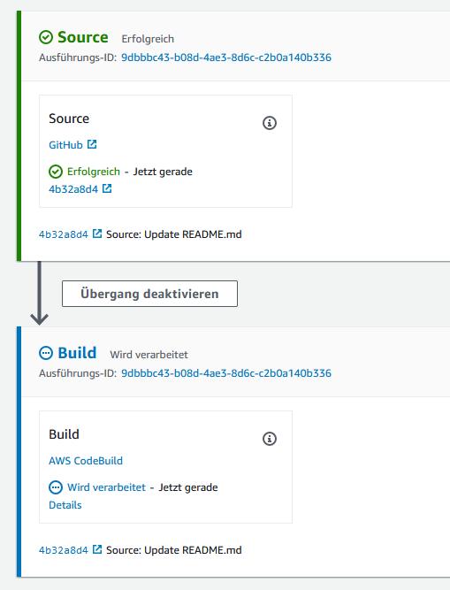

Mit dem kostenlosen [Kontingent für AWS](https://aws.amazon.com/de/free/free-tier/ "Kontingent für AWS") bekommt man immer eine aktive [AWS Codepipeline](https://aws.amazon.com/codepipeline/?did=ft_card&trk=ft_card "AWS Codepipeline") pro Monat und [100 Minuten AWS Codebuild](https://aws.amazon.com/codebuild/?did=ft_card&trk=ft_card "100 Minuten AWS Codebuild") pro Monat.
So kann man umsonst bzw. bei mehr als 100 Build Minuten im Monat für relativ wenig Geld eine Continuous Integration beziehungsweise Continuous Delivery Pipeline einrichten, die bei jedem Push an ein GitHub Repository einen Build triggert und diesen dann automatisch auf S3 deployed und optional auch noch CloudFront Cache invalidiert.

## CodeBuild
Als aller Erstes benötigt man eine neues Build Projekt in CodeBuild.
In der Projektonfiguration kann man einen Namen dafür vergeben und bei **Quelle** als Quellanbieter GitHub auswählen.
Je nachdem ob das Repository öffentlich oder nicht ist wählt man dann "Öffentliches Repository" und gibt die Repository-URL an oder man vernüpft sein GitHub Konto und gibt CodeBuild die benötigten Rechte um auf das Repository zuzugreifen.

Unter **Umgebung** muss nun ein Umgebungs Image ausgewählt werden. Für GatsbyJS wäre das ein "Verwaltetes Image" und das Betriebssystem "Amazon Linux 2". Als Laufzeiten(en) wird "Standard" ausgewählt und "aws/codebuild/amazonlinux2-x86_64-standard:2.0" als Image.


Nun kann auch gleich automatisch eine neue Servicerolle erstellt werden (die benötigt wird), damit CodeBuild die benötigten Rechte für das AWS-Konto hat.
> Dieser Servicerolle kann auch gleich Rechte für CodePipeline zugewiesen werden,sodass diese Servicerolle für CodeBuild und CodePipeline genutzt werden kann.
Sofern Umgebungsvariablen genutzt werden können diese unter "Zusätzliche Konfiguration" in der Umgebung angegeben werden. Außerdem kann man sich noch einmal vergewissern das auch wirklich "3GB Arbeitspeicher, 2vCPUs" ausgewählt ist, da nur diese Option im kostenlosen Kontigent enthalten ist.

Bei **Buildspec** wird nun eine buildspec-Datei im YAML-Format verwendet. Für einen typischen Gatsby build sollte diese etwa so aussehen.
```yml
version: 0.2
phases:
    install:
        runtime-versions:
            nodejs: 12
        commands:
            - 'touch .npmignore'
            - 'npm install -g gatsby'
    pre_build:
        commands:
            - 'npm install'
    build:
        commands:
            - 'npm run build'
    post_build:
        commands:       
            - 'find public -type f -regex ".*\.\(htm\|html\|txt\|text\|js\|css\|json\)$" -exec gzip -f -k {} \' ## sofern cloudfront nicht automatisch die dateien komprimiert
artifacts:
    base-directory: public
    files:
        - '**/*'
    discard-paths: no
cache:
    paths:
        - '.cache/*'
        - 'public/*'
```
Die Datei buildspec.yml muss nur im Root-Verzeichnis abgelegt werden, sodass CodeBuild diese finden kann.
Außerdem muss das build-script natürlich noch in "package.json" vorhanden sein.
```json
"build": "py ./src/utils/scripts/resize_images.py && gatsby build",
```
Bei mir werden zum Beispiel vor jedem Build auch noch einmal alle Bilder optimiert.

Unter **Artefakte** können die default-Einstellungen beibehalten werden.
Mit CloudWatch hat man die Möglichkeit Logs für CodeBuild in einem S3 Bucket abspeichern.
> Dabei können zusätzliche Kosten anfallen!!

Wenn nun alle Einstellungen korrekt angegeben wurden, kann das Build Projekt erstellt werden.
Jetzt fehlt nurnoch die CodePipeline, die einen Build triggert und im S3-Bucket deployed.

## CodePipeline

Dafür wechselt man logischerweise zu CodePipeline und erstellt eine neue Pipeline, bei der wieder als erstes ein Name und eine Servicerolle ausgewählt wird.

Bei Quelle kann man nun sich mit einem GitHub Account anmelden und das jeweilige Repository mit einem Branch verknüpfen.
Um einen Build zu triggern hat man nun zwei Möglichkeiten.

+ GitHub-Webhooks und
+ AWS CodePipeline

Danach wählt man den Build-Anbieter "AWS CodeBuild" und das zuvor erstellte Projekt aus oder (sofern man das noch nicht gemacht hat) erstellt ein neues Projekt.

Nach einem Build kann der public/ Ordner auch automatisch mit AWS CodeDeploy auf ein S3-Bucket deployed werden.
_Alternativ_ kann man diesen Schritt auch überspringen und [gatsby-plugin-s3](https://github.com/jariz/gatsby-plugin-s3 "gatsby-plugin-s3"), dass zusätzlich auch auch noch caching optimiert.
```bash
npm i gatsby-plugin-s3
```
bzw.
```bash
yarn add gatsby-plugin-s3
```
Nun fehlt noch die Konfiguration in gatsby-config.js und das deployment script
```js
plugins: [
  {
      resolve: `gatsby-plugin-s3`,
      options: {
          bucketName: 'my-website-bucket'
      },
  },
]
```
```json
"scripts": {
    ...
    "deploy": "gatsby-plugin-s3 deploy --yes"
}
```
Das deploy-script "npm run deploy" muss dann natürlich noch in der buildspec-Datei unter post-build commands ergänzt werden.
Die CodePipeline sollte nun etwa wie folgt aussehen:


Ein Build für ca. 100 Seiten dauert erfahrungsgemäß ca. 10 Minuten.

Jedes Mal wenn CodePipeline nun einen Push an das GitHub Repository erkennt wird automatisch ein Build getriggert und auf einem S3-Bucket bereitgestellt.

Mit ```aws cloudfront create-invalidation --distribution-id DISTRIBUTION_ID --paths /*``` kann zusätzlich der CloudFront Cache invalidiert werden.