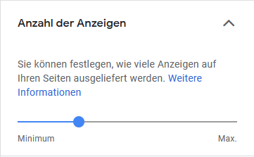

In general there are two possibilies to use GoogleAdsense on your GatsbyJS website:
+ **Auto Ads** and
+ custom **display blocks**.

Depending on whether you choose to include Adsense ads on certain spots or whether you will leave this job to the Google AI, you can choose one/and or the other.

## Auto Ads

With Auto Ads, the optimal positions foran advertising banner are determined using a Google Ai and a display ad
With Auto Ads, the optimal positions for an advertising banner are determined using a Google AI and a display ad is automatically switched there. All you have to do is place the following AdSense code in ``html.js``.
```html
<script data-ad-client="ca-pub-0037698828864449" async src="https://pagead2.googlesyndication.com/pagead/js/adsbygoogle.js"></script>
```
On GIS-Netzwerk.com I use Auto ads and I'm honestly surprised how well it works.
Ads are displayed in a text every few paragraphs and are responsive.

**Number of ads**

You also have the option of increasing or decreasing the number of displays in the settings.
Unfortunately, however, you cannot specify a specific number.



**Display formats**
You can also influence the ad formats.
Basically there are:
+ In-page ads (displayed in the main part of the page)
+ Content recommendations (tool for content promotion)
+ Anchor texts (mobile ads on the edge of the screen)
+ Vignette (mobile full screen display, at page transitions)

I have only deactivated anchor texts, because I personally find them very annoying and don't want to ask anyone else.


n addition, you can also completely exclude individual pages from advertisements.

If you want to use Auto ads on your GatsbyJS page, you can do it super easily with the plugin [gatsby-plugin-google-adsense](https://www.gatsbyjs.org/packages/gatsby-plugin-google-adsense/ "gatsby-plugin-google-adsense").

**Install**
```bash
npm install --save gatsby-plugin-google-adsense
```
bzw.
```bash
yarn add gatsby-plugin-google-adsense
```
**modify gatsby-config.js**
```js
// In your gatsby-config.js file
plugins: [
    {
      resolve: `gatsby-plugin-google-adsense`,
      options: {
        publisherId: `ca-pub-xxxxxxxxxx`
      },
    },
]
```
The remaining settings can then be adjusted on [Adsense](https://www.google.com/adsense/ "Adsense").

## Ad units
In addition to auto ads, there is also the "classic" option of inserting individual ad units at specific positions.
With the React Component [react-adsense](https://github.com/hustcc/react-adsense "react-adsense") you can insert Google AdSense and Baidu ads in any place.

```bash
npm install --save react-adsense
```
or
```bash
yarn add react-adsense
```

In order for the components to be rendered, you still need the AdSense script code. You can either insert this manually in the `` html.js '' file or, if you want to combine individual ad units with Auto ads, you can also use the plug-in already mentioned to insert the script.

> When auto ads and individual ad units are combined, the individual ad units always have a higher "priority". This means that all ad units that are inserted manually are usually also rendered and, if the text / ads ratio permits, additional ads from Auto ads are automatically inserted.

If the script has been integrated and react-adsense has been installed, you can use
```js
import React from 'react';
import AdSense from 'react-adsense';

// ads with no set-up
<AdSense.Google
  client='ca-pub-7292810486004926'
  slot='7806394673'
/>

// ads with custom format
<AdSense.Google
  client='ca-pub-7292810486004926'
  slot='7806394673'
  style={{ width: 500, height: 300, float: 'left' }}
  format=''
/>

// responsive and native ads
<AdSense.Google
  client='ca-pub-7292810486004926'
  slot='7806394673'
  style={{ display: 'block' }}
  layout='in-article'
  format='fluid'
/>

// auto full width responsive ads
<AdSense.Google
  client='ca-pub-7292810486004926'
  slot='7806394673'
  style={{ display: 'block' }}
  format='auto'
  responsive='true'
  layoutKey='-gw-1+2a-9x+5c'
/>
```
to insert components for the ad units.


The respective client id
```js
client='ca-pub-7292810486004926'
``` 
and the ad slot 
```js
slot='7806394673'
```
**must always be specified**.

The rest is optional.
```
Optional props:
    className:
    style:
    layout:
    layoutKey:
    format:
    responsive:
```

[react-adsense](https://github.com/hustcc/react-adsense "react-adsense")